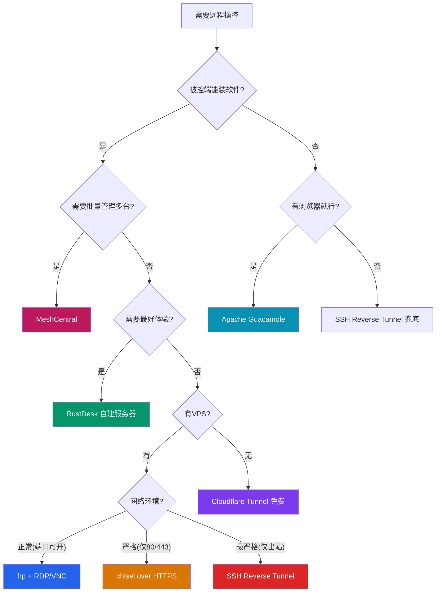
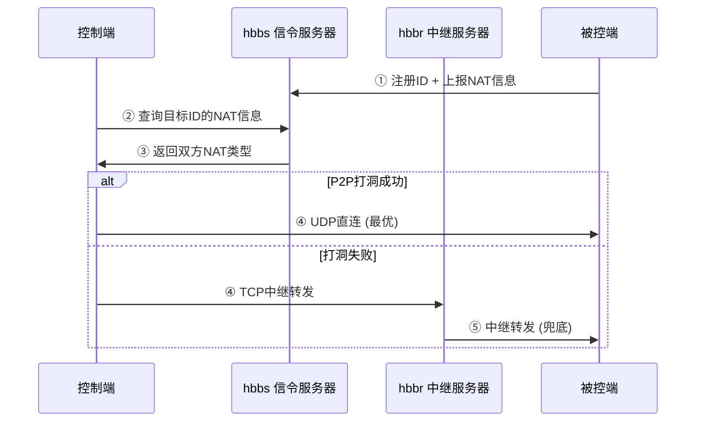
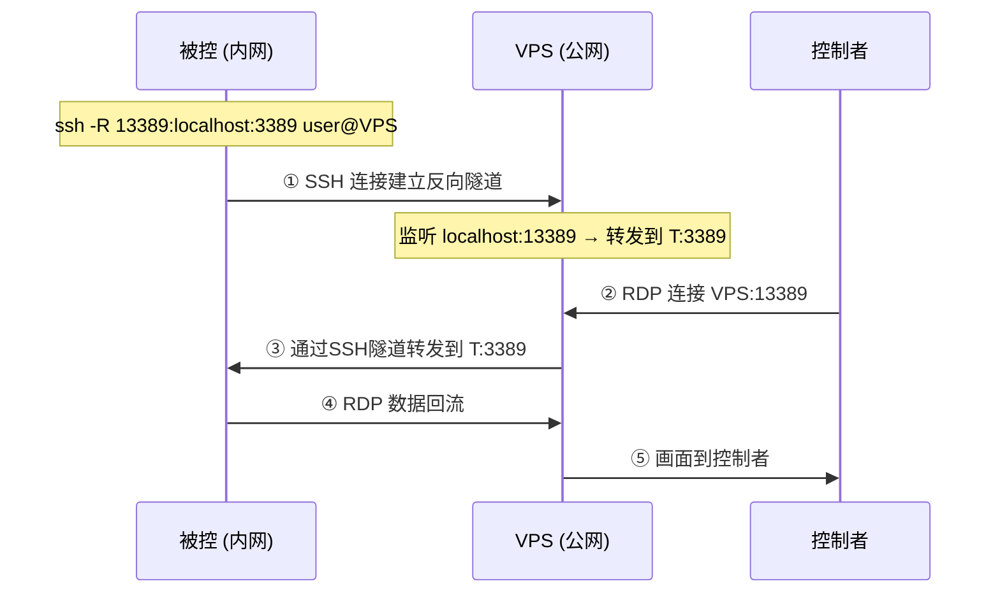
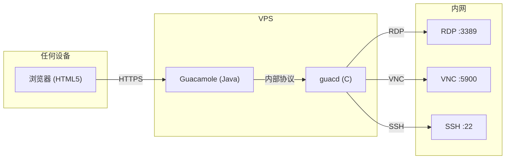

# ⚡ 远程操控 · 战术手册

> **版本** v1.0 | **维护者** 自由的风 | **原则** 三级兜底，永不卡壳
>
> 任何时候需要远程操控，翻到对应场景，复制粘贴即可落地。

---

## 📐 体系架构

```
┌──────────────────────────────────────────────────────────┐
│                    控制端 (你的手机/电脑)                    │
│           浏览器 | RDP客户端 | SSH客户端 | RustDesk         │
└──────────────┬──────────────┬──────────────┬──────────────┘
               │              │              │
    ┌──────────▼──┐  ┌────────▼───┐  ┌───────▼──────────┐
    │ Guacamole   │  │ Cloudflare │  │  直接RDP/VNC/SSH  │
    │ (浏览器网关) │  │ Tunnel     │  │  (走隧道/VPN)     │
    └──────┬──────┘  └─────┬──────┘  └───────┬──────────┘
           │               │                 │
           └───────────────┼─────────────────┘
                           │
              ┌────────────▼──────────────┐
              │      隧道层 / 网络层        │
              │  frp | rathole | chisel   │
              │  Headscale | ZeroTier     │
              │  SSH Reverse | WireGuard  │
              └────────────┬──────────────┘
                           │
              ┌────────────▼──────────────┐
              │      VPS (唯一公网节点)     │
              │  低配即可: 1C1G / 3Mbps    │
              └───────────────────────────┘
```

---

## 🧭 决策树：选什么工具



---

# 🥇 RustDesk 自建（桌面操控王者）

## 架构原理



## 一键部署

### docker-compose.yml — 直接复制

```yaml
version: '3.8'

services:
  hbbs:
    image: rustdesk/rustdesk-server:latest
    container_name: rustdesk-hbbs
    command: hbbs
    volumes:
      - ./rustdesk-data:/root
    network_mode: host
    restart: unless-stopped
    depends_on:
      - hbbr

  hbbr:
    image: rustdesk/rustdesk-server:latest
    container_name: rustdesk-hbbr
    command: hbbr
    volumes:
      - ./rustdesk-data:/root
    network_mode: host
    restart: unless-stopped
```

### 启动 & 查 Key

```bash
# 启动
docker compose up -d

# 获取客户端密钥（填入所有客户端）
cat ./rustdesk-data/id_ed25519.pub
```

### 客户端配置

| 设置项 | 值 |
|--------|-----|
| ID 服务器 | `你的VPS公网IP` |
| 中继服务器 | `你的VPS公网IP` |
| Key | `id_ed25519.pub 的内容` |

---

### 端口清单

| 端口 | 协议 | 用途 | 必须开放 |
|------|------|------|:------:|
| 21115 | TCP | NAT 类型测试 | ✅ |
| 21116 | TCP/UDP | ID 注册 & 心跳 | ✅ |
| 21117 | TCP | 中继连接 | ✅ |
| 21118 | TCP | WebSocket (可选) | ❌ |

### 故障速查

| 症状 | 原因 | 解决 |
|------|------|------|
| 显示"未连接到服务器" | 21116 端不通 | `ufw allow 21116` + 云安全组放行 |
| 连接成功但远程黑屏 | 21117 不通 | 检查中继端口防火墙 |
| 画面卡顿严重 | P2P 打洞失败 | 检查 UDP 是否放行，双方 NAT 类型 |
| Key 对不上 | 重建了容器 | 重新挂载 volume，保持 key 持久 |
| CPU 100% on 双核 | 已知 bug | `command: hbbs -c 1` |

---

# 🥈 frp 隧道（多协议全能）

## 端口映射速览

```
被控电脑(内网)                     VPS(公网)                       控制端
┌──────────────┐                ┌──────────────┐              ┌──────────┐
│ RDP  :3389   │── frp隧道 ──▶│  :33890      │── RDP ──▶  │ 你的手机  │
│ SSH  :22     │── frp隧道 ──▶│  :22022      │── SSH ──▶  │ 你的电脑  │
│ VNC  :5900   │── frp隧道 ──▶│  :59001      │── VNC ──▶  │ 你的平板  │
│ Web  :3000   │── frp隧道 ──▶│  web.域名.com│── HTTPS ──▶│ 任意浏览器 │
└──────────────┘                └──────────────┘              └──────────┘
```

## 完整配置 — 直接复制

### 服务端 `frps.toml`

```toml
# ===== 基础 =====
bindPort = 7000

# ===== 认证 =====
auth.token = "替换为你的强密码-至少32位随机字符串"

# ===== 管理面板 =====
webServer.addr = "0.0.0.0"
webServer.port = 7500
webServer.user = "admin"
webServer.password = "替换为面板密码"

# ===== 端口范围 =====
allowPorts = [
  { start = 33001, end = 33999 },
  { start = 22001, end = 22999 },
  { start = 59001, end = 59999 }
]

# ===== 性能 =====
transport.maxPoolCount = 10
transport.tcpMux = true
```

### 客户端 `frpc.toml`

```toml
# ===== 连接 =====
serverAddr = "你的VPS公网IP"
serverPort = 7000
auth.token = "替换为你的强密码"

# ===== RDP 远程桌面 =====
[[proxies]]
name = "rdp"
type = "tcp"
localIP = "127.0.0.1"
localPort = 3389
remotePort = 33890
transport.useEncryption = true
transport.useCompression = true

# ===== SSH =====
[[proxies]]
name = "ssh"
type = "tcp"
localIP = "127.0.0.1"
localPort = 22
remotePort = 22022

# ===== VNC =====
[[proxies]]
name = "vnc"
type = "tcp"
localIP = "127.0.0.1"
localPort = 5900
remotePort = 59001

# ===== SOCKS5 全局代理 =====
[[proxies]]
name = "socks5"
type = "tcp"
localIP = "127.0.0.1"
localPort = 1080
remotePort = 10801

# ===== 内网 Web =====
[[proxies]]
name = "nas-web"
type = "http"
localIP = "192.168.1.100"
localPort = 5000
customDomains = ["nas.你的域名.com"]
```

### 注册为系统服务

**Linux (systemd)**
```bash
sudo tee /etc/systemd/system/frpc.service << 'EOF'
[Unit]
Description=frp client
After=network.target

[Service]
Type=simple
User=root
ExecStart=/usr/local/bin/frpc -c /etc/frp/frpc.toml
Restart=on-failure
RestartSec=15s

[Install]
WantedBy=multi-user.target
EOF

sudo systemctl daemon-reload
sudo systemctl enable --now frpc
```

**Windows (PowerShell 管理员)**
```powershell
# 使用 nssm (先装: winget install nssm)
nssm install frpc "C:\frp\frpc.exe" "-c C:\frp\frpc.toml"
nssm set frpc AppStdout "C:\frp\frpc.log"
nssm set frpc AppStderr "C:\frp\frpc.log"
nssm set frpc Start SERVICE_AUTO_START
nssm start frpc
```

---

# 🥉 chisel 穿透防火墙

## 适用场景

> 防火墙只留 80/443，其他端口全封 → **chisel 是唯一解**

```mermaid
graph LR
    subgraph 公司网络(严格防火墙)
        PC["被控PC :3389 RDP"]
    end
    subgraph 公网
        VPS["VPS :443 chisel server"]
    end
    subgraph 外部
        YOU["你的手机/电脑"]
    end
    
    PC -->|"HTTPS (443) 反向连接"| VPS
    YOU -->|"RDP 连 VPS:13389"| VPS
    VPS -.->|"隧道转发"| PC
    
    style PC fill:#dc2626,color:#fff
    style VPS fill:#2563eb,color:#fff
    style YOU fill:#059669,color:#fff
```

## 命令速查

### VPS 服务端

```bash
# 基础启动
chisel server --port 443 --auth "admin:强密码" --reverse

# Docker 方式
docker run -d --restart unless-stopped --name chisel \
  -p 443:8080 \
  jpillora/chisel server --port 8080 --auth "admin:强密码" --reverse

# 生成持久密钥（避免每次重启指纹变化）
chisel server --keygen chisel.key
chisel server --port 443 --auth "admin:强密码" --reverse --keyfile chisel.key
```

### 被控端（内网电脑）

```bash
# Windows (PowerShell)
.\chisel.exe client --auth "admin:强密码" ^
  https://VPS_IP:443 ^
  R:13389:127.0.0.1:3389 ^
  --fingerprint "服务器指纹"

# Linux
./chisel client --auth "admin:强密码" \
  https://VPS_IP:443 \
  R:13389:127.0.0.1:3389

# 如果内网还要走公司HTTP代理
./chisel client --auth "admin:强密码" \
  https://VPS_IP:443 \
  R:13389:127.0.0.1:3389 \
  --proxy http://proxy.company.com:8080
```

### 控制端使用

```
RDP 连接: VPS_IP:13389
```

### 多端口转发

```bash
# 同时暴露 RDP + SSH + 内网Web
chisel client --auth "admin:强密码" \
  https://VPS_IP:443 \
  R:13389:127.0.0.1:3389 \
  R:22022:127.0.0.1:22 \
  R:8080:192.168.1.100:80
```

### 故障排查

| 症状 | 解决 |
|------|------|
| `x509: certificate signed by unknown authority` | 加 `--fingerprint` 参数，或服务端改用 HTTP |
| `auth failed` | 用户名密码不匹配，或被控端用了错误凭证 |
| 连上但 RDP 不通 | 被控电脑 RDP 未开启；检查 `netstat -an \| findstr 3389` |
| `connection refused` | VPS 端 chisel 未启动或端口未开放 |

---

# 🏅 rathole — frp 的高性能替代

> 内存只有 frp 的 **1/10**，吞吐比 frp 高 **2-3×**，单二进制 **~500KB**

### 服务端 `server.toml`

```toml
[server]
bind_addr = "0.0.0.0:2333"

[server.transport]
type = "noise"    # 零配置加密，无需证书

[server.services.rdp]
token = "rdp-secret-token-32位随机"
bind_addr = "0.0.0.0:33890"

[server.services.ssh]
token = "ssh-secret-token-32位随机"
bind_addr = "0.0.0.0:22022"
```

### 客户端 `client.toml`

```toml
[client]
remote_addr = "VPS_IP:2333"

[client.transport]
type = "noise"

[client.services.rdp]
token = "rdp-secret-token-32位随机"
local_addr = "127.0.0.1:3389"

[client.services.ssh]
token = "ssh-secret-token-32位随机"
local_addr = "127.0.0.1:22"
```

### 启动

```bash
# 服务端
./rathole server.toml

# 客户端
./rathole client.toml

# systemd 参考 (见 rathole 仓库 examples/systemd)
```

---

# 💀 零层兜底 · SSH Reverse Tunnel

> **不需要装任何额外软件。Windows 10+/Linux/macOS 全自带。**
> 这是任何时候最后一根救命稻草。

### 原理图



### 一条命令

```bash
# 被控电脑执行 (把本地 3389 映射到 VPS 的 13389)
ssh -R 13389:localhost:3389 -N -o ServerAliveInterval=60 user@你的VPS_IP

# 多端口版本
ssh -R 13389:localhost:3389 -R 22022:localhost:22 -N user@VPS_IP
```

### Windows 自动重连脚本

```powershell
# auto-tunnel.ps1 — 放到计划任务每分钟执行
$action = {
    $tunnel = Get-Process ssh -ErrorAction SilentlyContinue | 
              Where-Object { $_.CommandLine -like "*13389*" }
    if (-not $tunnel) {
        Start-Process ssh -ArgumentList @(
            "-R", "13389:localhost:3389",
            "-N", "-o", "ServerAliveInterval=30",
            "-o", "ExitOnForwardFailure=yes",
            "user@你的VPS_IP"
        ) -WindowStyle Hidden
    }
}
```

### VPS 必须配置

```bash
# /etc/ssh/sshd_config 添加
GatewayPorts yes
ClientAliveInterval 60
ClientAliveCountMax 3

# 重启生效
sudo systemctl restart sshd
```

> ⚠️ **不设 `GatewayPorts yes`，隧道端口只对 VPS 本地开放，外网连不进来。**

---

# 🎨 Apache Guacamole（无客户端方案）

> 任何有浏览器的设备都能操控远程桌面，包括手机、iPad、Chromebook



### Docker 一键

```yaml
version: '3.8'

services:
  guacd:
    image: guacamole/guacd:latest
    container_name: guacd
    restart: unless-stopped
    volumes:
      - ./guac-drive:/drive
      - ./guac-record:/record

  guacamole:
    image: guacamole/guacamole:latest
    container_name: guacamole
    restart: unless-stopped
    ports:
      - "8080:8080"
    environment:
      GUACD_HOSTNAME: guacd
      POSTGRESQL_HOSTNAME: postgres
      POSTGRESQL_DATABASE: guacamole_db
      POSTGRESQL_USER: guacamole
      POSTGRESQL_PASSWORD: 强密码
    depends_on:
      - guacd
      - postgres

  postgres:
    image: postgres:16-alpine
    container_name: guac-postgres
    restart: unless-stopped
    environment:
      POSTGRES_DB: guacamole_db
      POSTGRES_USER: guacamole
      POSTGRES_PASSWORD: 强密码
    volumes:
      - ./guac-db:/var/lib/postgresql/data
```

```bash
# 初始化数据库
docker run --rm guacamole/guacamole \
  /opt/guacamole/bin/initdb.sh --postgresql > initdb.sql

docker exec -i guac-postgres psql -U guacamole guacamole_db < initdb.sql

# 访问 http://VPS_IP:8080/guacamole
# 默认: guacadmin / guacadmin (首次登录必须改密码!)
```

---

# ☁️ Cloudflare Tunnel（零成本）

> 无需 VPS，Cloudflare 免费提供公网入口

```bash
# 1. 安装 (Windows)
winget install --id Cloudflare.cloudflared

# 1. 安装 (Linux)
curl -L https://github.com/cloudflare/cloudflared/releases/latest/download/cloudflared-linux-amd64 \
  -o /usr/local/bin/cloudflared && chmod +x /usr/local/bin/cloudflared

# 2. 认证 (会打开浏览器)
cloudflared tunnel login

# 3. 创建隧道
cloudflared tunnel create home-tunnel

# 4. 配置
# ~/.cloudflared/config.yml
```

```yaml
tunnel: <替换为你的tunnel-id>
credentials-file: /home/user/.cloudflared/<tunnel-id>.json

ingress:
  # RDP → 浏览器内访问
  - hostname: rdp.你的域名.com
    service: rdp://192.168.1.100:3389

  # SSH → 浏览器内终端
  - hostname: ssh.你的域名.com
    service: ssh://192.168.1.100:22

  # 内网 Web 服务
  - hostname: nas.你的域名.com
    service: http://192.168.1.100:5000

  # 兜底
  - service: http_status:404
```

```bash
# 5. 路由 DNS
cloudflared tunnel route dns home-tunnel rdp.你的域名.com
cloudflared tunnel route dns home-tunnel ssh.你的域名.com

# 6. 运行 (注册为服务)
cloudflared tunnel run home-tunnel

# 安装为系统服务
sudo cloudflared service install
```

---

# 🌐 Headscale (Tailscale 自部署)

> 构建私有 Mesh VPN，所有设备虚拟局域网互联

```yaml
version: '3.8'

services:
  headscale:
    image: headscale/headscale:latest
    container_name: headscale
    restart: unless-stopped
    volumes:
      - ./headscale-config:/etc/headscale
      - ./headscale-data:/var/lib/headscale
    ports:
      - "8080:8080"
      - "9090:9090"
    command: headscale serve
```

```yaml
# ./headscale-config/config.yaml
server_url: https://vpn.你的域名.com
listen_addr: 0.0.0.0:8080
metrics_listen_addr: 0.0.0.0:9090

# 允许的 IP 段
ip_prefixes:
  - 100.64.0.0/10

# DERP 中继 (可自建)
derp:
  server:
    enabled: false
  urls: []

# MagicDNS
dns_config:
  magic_dns: true
  base_domain: mynet.local
```

```bash
# 创建用户
docker exec headscale headscale users create admin

# 注册设备
docker exec headscale headscale --user admin preauthkeys create --reusable --expiration 24h

# 客户端连接
tailscale up --login-server https://vpn.你的域名.com --authkey <key>
```

---

# 🛡️ 兜底保障链

```
Level 1  RustDesk    → P2P 优先，零配置体验，最佳画质
         失败 ↓
Level 2  frp/rathole → TCP 隧道，稳定可靠，多协议支持
         失败 ↓
Level 3  chisel      → HTTP/HTTPS 隧道，过防火墙
         失败 ↓
Level 4  Cloudflare  → 出站连接，免费，无需 VPS
         失败 ↓
Level 5  SSH Reverse → 系统自带，零依赖，终极兜底
         失败 ↓
Level X  WireGuard   → UDP 高位端口，最后手段
```

| 故障级 | 工具 | 前置条件 | 失败原因极少 |
|:---:|------|------|:---:|
| 1 | RustDesk | VPS + Docker | UDP 端口被封 |
| 2 | frp | VPS开放端口 | 端口被封 |
| 3 | chisel | VPS开放443 | HTTPS被深度包检测 |
| 4 | Cloudflare | 域名在CF | 企业封锁CF IP段 |
| 5 | SSH Reverse | VPS开放22 | SSH 协议被DPI阻断 |
| X | WireGuard | VPS开放UDP | 全端口封锁 (监狱级) |

---

# 📋 快速复制卡

### RustDesk 自建
```bash
mkdir rustdesk && cd rustdesk
# 复制上面的 docker-compose.yml
docker compose up -d
cat ./rustdesk-data/id_ed25519.pub  # 这是客户端的Key
```

### frp RDP 暴露
```bash
# VPS: 复制上面的 frps.toml → ./frps -c frps.toml
# 内网: 复制上面的 frpc.toml → ./frpc -c frpc.toml
# 连接: RDP → VPS_IP:33890
```

### chisel 突破防火墙
```bash
# VPS: chisel server --port 443 --auth "u:p" --reverse
# 内网: chisel client --auth "u:p" https://VPS:443 R:13389:127.0.0.1:3389
# 连接: RDP → VPS_IP:13389
```

### SSH 终极兜底
```bash
# 内网: ssh -R 13389:localhost:3389 -N user@VPS
# 连接: RDP → VPS_IP:13389
# ⚠️ VPS: GatewayPorts yes in sshd_config
```

---

> **你永远不会卡壳。翻到对应场景，复制，粘贴，回车。**
>
> 每次遇到新环境新限制，这本手册会继续进化。
